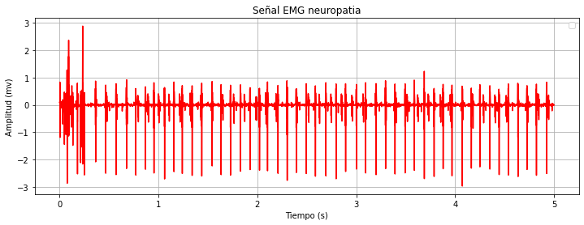
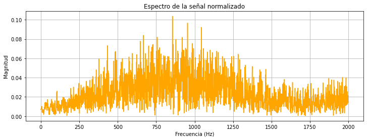
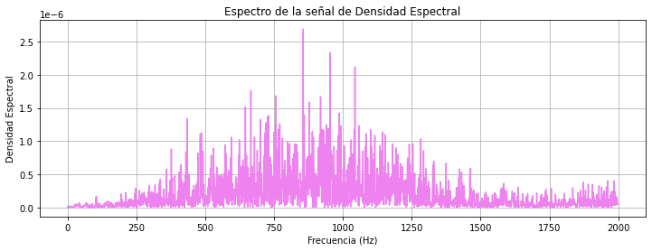
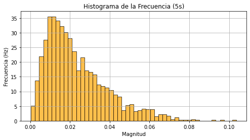
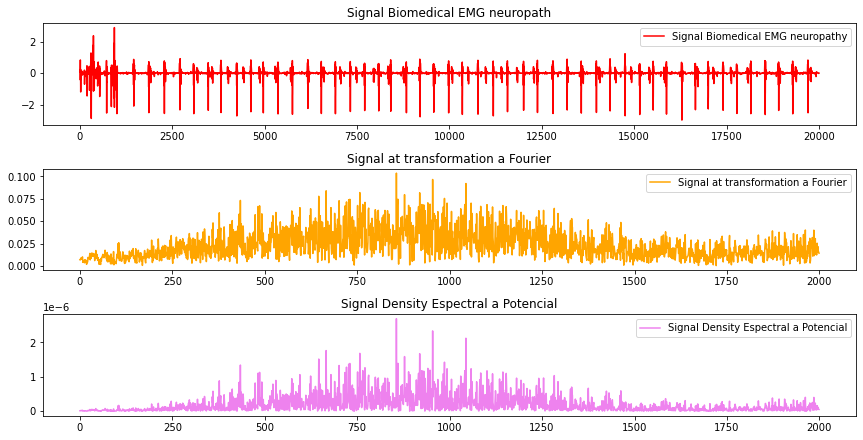

# LABORATORIO PSD  #2
## Covolución, correlación y transformación

En el presente informe se muestra el código cuyo objetivo es reconocer las distintas convolución como una operación entre señal y sistema, la correlación como una operación entre señales y  la transformada como herramienta de análisis en el dominio de la 
frecuencia. 
## convoluciónes 
La convolución se puede definir como una opreación matematica que combina dos señales para producir una tercera señal. La definicón matematica de la convolución de dos señales x[n] y h[n] se define como.

                        y[n] = x[n] * h[n] 

donde y[n] se puede interpretar como la señal de salida, x[n] es la señal de entrada y h[n] se interpreta como la función de impulso del sistema. 

Un ejemplo de convolución es una señal de audio que contiene ruido y queremos eliminarlo  utilizando un filtro digital.
En la señal de audio original hay  ruido y seria x[n] que representa la entrada de la señal.Para arreglar esto diseñamos un filtro digital  para eliminar el ruido. El filtro se representa como una señal de impulso h[n]. Para obtener la señal sin ruido usamos la convolución que se realiza multiplicando la señal de entrada x[n] por el filtro h[n] y sumando los resultados, esto me va a generar la señal de audio filtrada que va a ser y[n].

Una vez explicada la convolución pasaremos a explicar el inciso numero uno que se realizó a mano.

El inciso nos decia que hallaramos la convolución de las señales de entrada x[n] y la señal de impulso h[n] que en este caso los datos numericos de las señales fueron el codigo y el numero de documento de los integrantes del grupo. En la imagen se puede evidenciar en la fila 1 y columna 1 de las tablas que se encuentran registrados los datos numericos expuestos. 

Usamos un ¨metodo de tabla de convolución¨ ya que es la manera más eficiente de encontrar la señal de salida y[n] cuando las señales multiplicadas tienen valores numericos muy extensos. En este método, se hace una tabla con la señal de entrada x[n] en la fila 1 en la parte superior  y la función de impulso h[n] en la columna izquierda. Luego, se multiplican los valores de las señales  de entrada y de función de impulso, y se suman los resultados para obtener la salida Y[n]. El procedimiento se hace de la siguente manera.

### Pasos para realizar la tabla de convolución a mano
    1) Se crea una tabla con la señal de entrada x[n] en la primera fila y la función de impulso h[n] en la primera columna.

    2)Se multiplican los valores de la señal de entrada x[n] y la función de impulso h[n] en cada celda de la tabla, tal como se muestra en la primera imagen.

    3)Se suman los resultados de las multiplicaciones en cada fila de la tabla de manera diagonal  para obtener la salida y[n].

### Representación grafica 
La gráfica de la convolución nos  muestra la relación  entre la suma de las multiplicaciones de los valores de la señal de entrada x[n] y la función de impulso h[n] en función del número de muestras que resultaron de la señal de salida y[n] que en nuestro caso fueron 16 muestras.

El eje X de la grafica de la imagen numero 2 representa el número de muestrasque se obtuvo de la señal de entrada x[n] y la función de impulso h[n] que se están multiplicando y sumando. A su vez en el eje y se representa el valor que hubo de la  multiplicación de los valores de la señal de entrada x[n] y la función de impulso h[n] en cada muestra.
## Inciso A en Python
Para realizar el primer ejercicio del inciso de manera digital se realizan los sifuientes pasos.

#### - Importamos las librerias

    import numpy as np
    import matplotlib.pyplot as plt

En primer lugar se definieron los arreglos h[n] y x[n] los cuales correspondian a nuestro codigo estudiantil y cedula de ciudadania.
   
    h = np.array([5,6,0,0,7,4,7]) # codigo estudiantil Jhonathan
    x = np.array([1,0,1,3,1,0,5,4,6,1]) # cedula ciudadana Jhonathan

Luego de esto graficamos a h[n] y x[n] esto gracias a la libreria matplotlib.pyplot como plt.

Graficamos primero h[n] donde en x iran la cantidad de datos y en y iran los datos que le pertenecen.

    # Graficar h[n] Jhonathan
    t = np.arange(len(h)) 
    plt.figure(figsize=(8, 4))
    plt.stem(t, h)
    plt.xlabel('n')
    plt.ylabel('h[n]')
    plt.title('h[n] Jhonathan')
    plt.grid()
    plt.show()

Aquí se puede observar de manera digital los datos de la señal que es el codigo estudiantil, que está representando la función de impulso h[n].

Luego de este vamos a graficar de la misma manera x[n]

    # Graficar x[n] Jhonathan
    t = np.arange(len(x))
    plt.figure(figsize=(8, 4))
    plt.stem(t, x)
    plt.xlabel('n')
    plt.ylabel('x[n]')
    plt.title('x[n] Jhonathan')
    plt.grid()
    plt.show()

Aquí se puede observar de manera digital los datos de la señal que es el el documento de indentidad, que está representando la señal de entrada h[n].

Ahora luego de esto haremos la convolucion de las dos graficas esto a traves del sistema para dar a y[n] el cual sera la convolucion de h[n] y x[n]

    y = np.convolve(x, h, mode='full') #Calcular la convolucion entre h[n] y x[n]
    print("Señal de la convolucion entre h[n] y x[n] osea y[n] de Jhonathan:", y) #Imprimir el resultado de la convolucion

Señal de la convolucion entre h[n] y x[n] osea y[n] de Jhonathan: [ 5 6 5 21 30 10 39 75 80 66 48 48 93 59 46 7]

Luego de esto vamos a graficar y[n] con la cantidad de datos n en este caso de y[n] y se va a graficar con plt

 # Graficar la convolución o y[n] Jhonathan
    t = np.arange(len(y))
    plt.figure(figsize=(8, 4))
    plt.stem(t, y)
    plt.xlabel('n')
    plt.ylabel('y[n]')
    plt.title('Convolución de h[n] y x[n] Jhonathan')
    plt.grid()
    plt.show()

En esta imagen se puede observar la grafica de la convolución de Jhonathan de manera digital, la cual nos muestra la multiplicación de las dos señales x[n] y h[n] en función del numero de mestras obtenida.

ahora se raliza el mismo ejercicio para hallár y graficar la convolución del codigo y la cedula de José.  lo unico que cambia es el array o los datos.

# Se define h[n] y x[n] 
        h = np.array([5,6,0,0,6,8,3]) # codigo estudiantil Jose
        x = np.array([1,0,2,7,1,5,0,7,2,5]) # cedula ciudadana Jose

        # Graficar h[n] Jose
        t = np.arange(len(h)) 
        plt.figure(figsize=(8, 4))
        plt.stem(t, h)
        plt.xlabel('n')
        plt.ylabel('h[n]')
        plt.title('h[n] Jose')
        plt.grid()
        plt.show()

Donde se observa la señal de manera digital que representa el h[n].

 # Graficar x[n] Jose
        t = np.arange(len(x))
        plt.figure(figsize=(8, 4))
        plt.stem(t, x)
        plt.xlabel('n')
        plt.ylabel('x[n]')
        plt.title('x[n] Jose')
        plt.grid()
        plt.show()

Nuevamente se observa la señal de entrada x[n] de manera digital de José.

     y = np.convolve(x, h, mode='full') #Calcular la convolucion entre h[n] y x[n]
        print("Señal de la convolucion entre h[n] y x[n] osea y[n] de Jose:", y) #Imprimir el resultado de la convolucion

Señal de la convolucion entre h[n] y x[n] osea y[n] de Jose: 
[  5   6  10  47  53  39  45  93 120  96  73  57  68  67  46  15]

        # Graficar la convolución o y[n] Jose
        t = np.arange(len(y))
        plt.figure(figsize=(8, 4))
        plt.stem(t, y)
        plt.xlabel('n')
        plt.ylabel('y[n]')
        plt.title('Convolución de h[n] y x[n] Jose')
        plt.grid()
        plt.show()

Por ultimo obtenemos la señal de la convolución y[n] de José.

## Inciso B

Ahora debemos hacer el inciso B en donde tenemos que definir a 𝑥1[𝑛𝑇𝑠] = cos(2𝜋100𝑛𝑇𝑠) y 𝑥2[𝑛𝑇𝑠] = sin(2𝜋100𝑛𝑇𝑠) para este sabemos que 𝑇𝑠 = 1.25𝑚s, 𝑝𝑎𝑟𝑎 0 ≤ 𝑛 < 9, y f es 100 ahora luego de ello vamos a hacer la correlacion con la libreria np.correlate entre x1 y x2.

        # Inciso o punto 8(b)
        Ts = 1.25e-3  #𝑇𝑠 = 1.25𝑚s
        n = np.arange(9) # 𝑝𝑎𝑟𝑎 0 ≤ 𝑛 < 9 
        f = 100  # 100𝑛𝑇s
        x1 = np.cos(2 * np.pi * f * n * Ts) #𝑥1[𝑛𝑇𝑠] = cos(2𝜋100𝑛𝑇𝑠)
        x2 = np.sin(2 * np.pi * f * n * Ts) #𝑥2[𝑛𝑇𝑠] = sin(2𝜋100𝑛𝑇𝑠)
        correlacion = np.correlate(x1, x2, mode='full') # Correlacione entre ambas señales
        print("Correlación cruzada osea el vector o resultado", correlacion)

Correlación cruzada osea el vector o resultado [-2.44929360e-16 -7.07106781e-01 -1.50000000e+00 -1.41421356e+00
 -1.93438661e-16  2.12132034e+00  3.50000000e+00  2.82842712e+00
  8.81375476e-17 -2.82842712e+00 -3.50000000e+00 -2.12132034e+00
  3.82856870e-16  1.41421356e+00  1.50000000e+00  7.07106781e-01
  0.00000000e+00]

Luego de este vamos a graficar la correlacion entre el seno y el coseno de x1 y x2 ahora este debemos tener en cuenta que la cantidad de datos es menos cantidad de datos mas uno en funcion a la cantidad de datos esto graficado en x y en Y la magnitud o el dato como tal de la correlacion.

        # Graficar Correlacion entre ambas señales
        t_corr = np.arange(-len(n) + 1, len(n))
        plt.figure(figsize=(8, 4))
        plt.stem(t_corr, correlacion)
        plt.xlabel('Desplazamiento')
        plt.ylabel('Correlación')
        plt.title('Correlación cruzada entre x1[n] y x2[n]')
        plt.grid()
        plt.show()

Para encontrar la correlación entre las señales, primero necesitamos calcular la media de cada una de ellas de x1[nTs] y x2[nTs].

Una vez que se tienen  las medias, podemos calcular la correlación entre x1[nTs] y  x2[nTs].

Por ultimo para encontrar la representación gráfica, podemos graficar la función x1 y x2 en función de n. Esto nos permitirá visualizar cómo varía la correlación a lo largo del tiempo.

## Inciso C

En primer lugar se toman los datos de la señal en donde se importan como EMG electromiografia

        EMG = "Datos_EMG/emg_neuropathy"

Luego se hace la lectura de la señal esto con la libreria wfdb, y se la dara los datos a la señal con un solo canal, fs sera la frecuencia y el numero de datos sera la cantidad que contenga signal en el tiempo luego se limitara a 5 segundos, se dara el tiempo con un if y el rango de los datos y por ultimo se limitara a muestreo osea 5 segundos

        lecturasignal = wfdb.rdrecord(EMG)
        signal = lecturasignal.p_signal[:,0]  
        fs = lecturasignal.fs  
        numero_datos = len(signal) 
        muestreo=int(5*fs)
        time = [i / fs for i in range(numero_datos)]  
        signal = signal[:muestreo]
        time = time[:muestreo]

Luego de esto vamos a graficar la señal original, esto con plt

        plt.figure(figsize=(12,4))
        plt.plot(time, signal, color="red")
        plt.xlabel("Tiempo (s)")
        plt.ylabel("Amplitud (mv)")
        plt.title("Señal EMG neuropatia")
        plt.legend()
        plt.grid()
        plt.show()

La electromiografía (EMG) es una técnica utilizada para registrar la actividad eléctrica de los músculos.Una señal de EMG se puede analizar para extraer información sobre la función muscular y diagnosticar trastornos neuromusculares. Esta señal se toma en función del tiempo y la amplitud en el eje x se toma el tiempo y en el eje y se toma la ampplitud de la señal que es el impulso electrico del musculo.

Luego de esto vamos a calcular los datos estadisticos en funcion al tiempo, esto sera la media, la longitud del vector, la desviacion estandar, el coeficiente de variacion y la mediana donde esto se hara de forma manual

        suma=0
        for i in range(len(signal)):
            suma += signal[i]
        media = suma/ len(signal)
        print(f"Media de la señal: {media:.4f}")

        longitud_vector = 0
        for _ in signal:
            longitud_vector +=1
        print(f"Longitud del vector: {longitud_vector}")

        desviacion = 0
        for i in range(len(signal)):
            desviacion += (signal[i] - media) ** 2
        desviacion_estandar = (desviacion/len(signal)) ** 0.5
        print(f"Desviación estándar: {desviacion_estandar:.4f}")

        coeficiente_de_variacion = desviacion_estandar/ media if media != 0 else float ('nan')
        print(f"Coeficiente de variación: {coeficiente_de_variacion:.4f}")

        def calcular_mediana(datos):
            datos_ordenados = sorted(datos)
            n = len(datos_ordenados)
            if n % 2 == 1:
                mediana = datos_ordenados[n // 2]  
            else:
                mediana = (datos_ordenados[n // 2 - 1] + datos_ordenados[n // 2]) / 2  # Promedio de los dos centrales
            return mediana

        mediana = calcular_mediana(signal)
        print(f"La mediana es : {mediana:.4f}")

Media de la señal: 0.0007

Longitud del vector: 20000

Desviación estándar: 0.2417

Coeficiente de variación: 346.5657

La mediana es : 0.0050

Luego de esto vamos a hayar los mismos datos estadisticos media, la longitud del vector, la desviacion estandar, el coeficiente de variacion y la mediana a traves de las librerias:

        mediana_librerias = np.median(signal)
        media_librerias = np.mean(signal)
        longitud_vector_librerias = len(signal)
        desviacion_librerias = np.std(signal)
        coeficiente_variacion_librerias = desviacion_librerias / media_librerias if media_librerias != 0 else np.nan

        print(f"Media de la señal con librerias: {media_librerias:.4f}")
        print(f"Longitud del vector con librerias: {longitud_vector_librerias}")
        print(f"Desviación estándar con librerias: {desviacion_librerias:.4f}")
        print(f"Coeficiente de variación con librerias: {coeficiente_variacion_librerias:.4f}")
        print(f"La mediana con librerias es: {mediana_librerias:.4f}")

Media de la señal con librerias: 0.0007

Longitud del vector con librerias: 20000

Desviación estándar con librerias: 0.2417

Coeficiente de variación con librerias: 346.5657

La mediana con librerias es: 0.0050

Ahora bien vamos a pasar la señal con la transformada de Fourier al espectro de las frecuencias recordando que la frecuencia es lo mismo que decir 1/T osea el periodo, para este vamos a tener un valor de t el cual sera la cantidad de datos dados en la fs osea frecuencia

        t = np.linspace(0, 1, fs, endpoint=False) 
        N = len(t)

Calcularemos la frecuencia con fft.fftfreq con la cantidad de datos N esto dado en el tiempo ya mediado y la frecuencia que sera 1/fs osea 1/T el periodo, el espectro se dara mediante fft.fft de la señal entre la cantidad de datos y por ultimo la magnitus sera el espectro multiplicado por dos y con un valor dado de 2 en la magnitud

        frequencies = np.fft.fftfreq(N, 1/fs)
        spectrum = np.fft.fft(signal) / N
        magnitude = 2 * np.abs(spectrum[:N//2]) 

Ahora vamos a graficar la señal pero como transformada de Fourier en donde la frecuencia se dara en N//2 en x y la magnitus en y para este

        plt.figure(figsize=(12,4))
        plt.plot(frequencies[:N//2], magnitude, 'orange')
        plt.xlabel('Frecuencia (Hz)')
        plt.ylabel('Magnitud')
        plt.title('Espectro de la señal normalizado')
        plt.grid()
        plt.show()

Se necesita graficar la señal EMG con la transformada de Fourier para analizar la frecuencia y la potencia de la señal. Al graficar la señal EMG en el dominio de la frecuencia, se puede lograr :

- Identificar las frecuencias dominantes en la señal
- Analizar la potencia de la señal en diferentes frecuencias
Por otra parte la frecuencia se expresa en N/2, donde N es el número de puntos que se encuentran en la señal.

Ahora bien el psd sera la magnitud dada por la transformada de Fourier elevada al cuadrado entre la cantidad de datos.

        psd = (magnitude ** 2) / N

Se grafica en x la frecuencia y en Y el psd o la densidad espectral

        plt.figure(figsize=(12,4))
        plt.plot(frequencies[:N//2], psd, 'violet')
        plt.xlabel('Frecuencia (Hz)')
        plt.ylabel('Densidad Espectral')
        plt.title('Espectro de la señal de Densidad Espectral')
        plt.grid()
        plt.show()

La densidad espectral  (Power Spectral Density - PSD) es la medida que describe la distribución potencial de una señal en diferentes frecuencias. Es decir la densidad espectral muestra cómo se distribuye la energía de una señal en el dominio de la frecuencia.

Al realizar la gráfica de la PSD se  muestra las frecuencias que dominan la señal EMG. Las frecuencias más altas que se encuentran en la grafica de un EMG suelen estar asociadas con la actividad muscular más intensa.Tambien la gráfica de la PSD puede mostrar cambios en la frecuencia y la potencia de la señal EMG que están asociados con la fatiga muscular.

Ahora calcularemos los datos estadisticos de la frecuencia igual con la media, la desviacion estandar y la mediana donde esto se hara de forma manual

        suma=0
        for i in range(len(magnitude)):
            suma += magnitude[i]
        media = suma/ len(magnitude)
        print(f"Media de la señal en cuanto a la frecuencia: {media:.4f}")

        desviacion = 0
        for i in range(len(magnitude)):
            desviacion += (magnitude[i] - media) ** 2
        desviacion_estandar = (desviacion/len(signal)) ** 0.5
        print(f"Desviación estándar en cuanto a la frecuencia: {desviacion_estandar:.4f}")

        mediana = calcular_mediana(magnitude)
        print(f"La mediana en cuanto a la frecuencia: {mediana:.4f}")

Media de la señal en cuanto a la frecuencia: 0.0234

Desviación estándar en cuanto a la frecuencia: 0.0049

La mediana en cuanto a la frecuencia: 0.0194

Por ultimo vamos a calcular la mediana, media y desviacion pero con librerias

        mediana_librerias = np.median(magnitude)
        media_librerias = np.mean(magnitude)
        desviacion_librerias = np.std(magnitude)

        print(f"Media de la señal con librerias en cuanto a la frecuencia: {media_librerias:.4f}")
        print(f"Desviación estándar con librerias en cuanto a la frecuencia: {desviacion_librerias:.4f}")
        print(f"La mediana en cuanto a la frecuencia : {mediana_librerias:.4f}")

Media de la señal con librerias en cuanto a la frecuencia: 0.0234

Desviación estándar con librerias en cuanto a la frecuencia: 0.0155

La mediana en cuanto a la frecuencia : 0.0194

Graficamos el Histograma en cuanto a la frecuencia, esto con la magnitud

        plt.figure(figsize=(8, 4))
        plt.hist(magnitude, bins=50, color='orange', alpha=0.7, edgecolor='black', density=True)
        plt.xlabel("Magnitud")
        plt.ylabel("Frecuencia (Hz)")
        plt.title("Histograma de la Frecuencia (5s)")
        plt.grid()
        plt.show()

La frecuencia de 5 Hz es la frecuencia dominante en tu señal de EMG. Esto sugiere que la actividad muscular que estás registrando tiene una frecuencia principal de 5 Hz. Segun los textos la frecuencia de 5 Hz es dentro del rango normal para la actividad muscular. Esto sugiere que la actividad muscular que estás registrando es normal y no hay signos de patología.

Ahora vamos a graficar la comparativa entre la señal original, la señal con la transformada de Fourier y la señal con la densidad espectral

        plt.figure(figsize=(12, 8))
        plt.subplot(4, 1, 1)
        plt.plot(signal, label="Signal Biomedical EMG neuropathy", color="red")
        plt.title("Signal Biomedical EMG neuropath")
        plt.legend()

        plt.subplot(4, 1, 2)
        plt.plot(magnitude[:muestreo//2], label="Signal at transformation a Fourier", color="orange")
        plt.title("Signal at transformation a Fourier")
        plt.legend()

        plt.subplot(4, 1, 3)
        plt.plot(psd[:muestreo//2], label="Signal Density Espectral a Potencial", color="violet")
        plt.title("Signal Density Espectral a Potencial")
        plt.legend()

        plt.tight_layout()
        plt.show()

### Requisitos

- Python 3.11
- Wfdb
- matplotlib
- Numpy

## Bibliografia
 - "Análisis de Señales de Electromiografía para la Detección de Patologías Musculares" Sánchez-Morales(2019).
 - "Análisis de Señales de EMG para la Evaluación de la - Fatiga Muscular" López-Díaz J.(2020).
 - Frecuencia Dominante en Señales de Electromiografía Gómez-Torres (2017).
 - Physiology, Engineering, and Non-Invasive Applications" Reaz (2011).

## Contacto
- **Jose Daniel Porras** est.jose.dporras@unimilitar.edu.co
- **Jhonathan David Guevara Ramirez** est.jhonathan.guev@unimilitar.edu.co 

