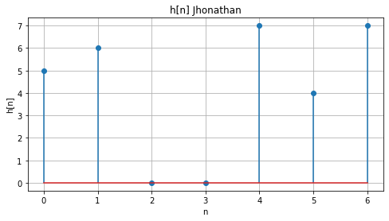
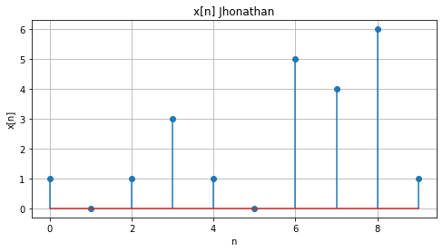
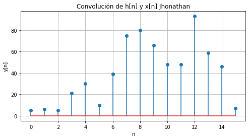
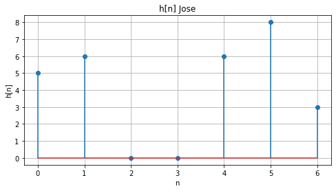
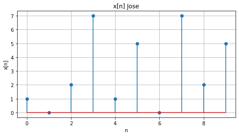
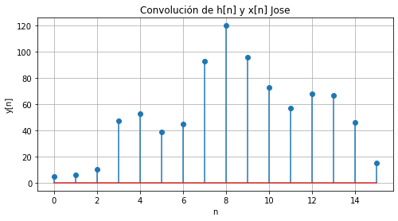
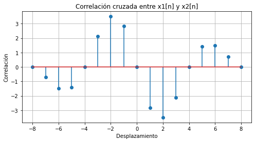

# LABORATORIO PSD 2

## Inciso A

Importamos las librerias 

        import numpy as np
        import matplotlib.pyplot as plt

En primer lugar se definieron los arreglos h[n] y x[n] los cuales correspondian a nuestro codigo estudiantil y cedula de ciudadania 

        h = np.array([5,6,0,0,7,4,7]) # codigo estudiantil Jhonathan
        x = np.array([1,0,1,3,1,0,5,4,6,1]) # cedula ciudadana Jhonathan

Luego de esto graficamos a h[n] y x[n] esto gracias a la libreria matplotlib.pyplot como plt.

Graficamos primero h[n] donde en x iran la cantidad de datos y en y iran los datos que le pertenecen.

        # Graficar h[n] Jhonathan
        t = np.arange(len(h)) 
        plt.figure(figsize=(8, 4))
        plt.stem(t, h)
        plt.xlabel('n')
        plt.ylabel('h[n]')
        plt.title('h[n] Jhonathan')
        plt.grid()
        plt.show()

Luego de este vamos a graficar de la misma manera x[n]

        # Graficar x[n] Jhonathan
        t = np.arange(len(x))
        plt.figure(figsize=(8, 4))
        plt.stem(t, x)
        plt.xlabel('n')
        plt.ylabel('x[n]')
        plt.title('x[n] Jhonathan')
        plt.grid()
        plt.show()

Ahora luego de esto haremos la convolucion de las dos graficas esto a traves del sistema para dar a y[n] el cual sera la convolucion de h[n] y x[n]

        y = np.convolve(x, h, mode='full') #Calcular la convolucion entre h[n] y x[n]
        print("Señal de la convolucion entre h[n] y x[n] osea y[n] de Jhonathan:", y) #Imprimir el resultado de la convolucion

Señal de la convolucion entre h[n] y x[n] osea y[n] de Jhonathan: 
[ 5  6  5 21 30 10 39 75 80 66 48 48 93 59 46  7]

Luego de esto vamos a graficar y[n] con la cantidad de datos n en este caso de y[n] y se va a graficar con plt

        # Graficar la convolución o y[n] Jhonathan
        t = np.arange(len(y))
        plt.figure(figsize=(8, 4))
        plt.stem(t, y)
        plt.xlabel('n')
        plt.ylabel('y[n]')
        plt.title('Convolución de h[n] y x[n] Jhonathan')
        plt.grid()
        plt.show()

Ahora realizaremos lo mismo con los datos de Jose lo unico que cambia es el array o los datos

        # Se define h[n] y x[n] 
        h = np.array([5,6,0,0,6,8,3]) # codigo estudiantil Jose
        x = np.array([1,0,2,7,1,5,0,7,2,5]) # cedula ciudadana Jose

        # Graficar h[n] Jose
        t = np.arange(len(h)) 
        plt.figure(figsize=(8, 4))
        plt.stem(t, h)
        plt.xlabel('n')
        plt.ylabel('h[n]')
        plt.title('h[n] Jose')
        plt.grid()
        plt.show()

        # Graficar x[n] Jose
        t = np.arange(len(x))
        plt.figure(figsize=(8, 4))
        plt.stem(t, x)
        plt.xlabel('n')
        plt.ylabel('x[n]')
        plt.title('x[n] Jose')
        plt.grid()
        plt.show()

        y = np.convolve(x, h, mode='full') #Calcular la convolucion entre h[n] y x[n]
        print("Señal de la convolucion entre h[n] y x[n] osea y[n] de Jose:", y) #Imprimir el resultado de la convolucion

Señal de la convolucion entre h[n] y x[n] osea y[n] de Jose: 
[  5   6  10  47  53  39  45  93 120  96  73  57  68  67  46  15]

        # Graficar la convolución o y[n] Jose
        t = np.arange(len(y))
        plt.figure(figsize=(8, 4))
        plt.stem(t, y)
        plt.xlabel('n')
        plt.ylabel('y[n]')
        plt.title('Convolución de h[n] y x[n] Jose')
        plt.grid()
        plt.show()

## Inciso B

Ahora debemos hacer el inciso B en donde tenemos que definir a 𝑥1[𝑛𝑇𝑠] = cos(2𝜋100𝑛𝑇𝑠) y 𝑥2[𝑛𝑇𝑠] = sin(2𝜋100𝑛𝑇𝑠) para este sabemos que 𝑇𝑠 = 1.25𝑚s, 𝑝𝑎𝑟𝑎 0 ≤ 𝑛 < 9, y f es 100 ahora luego de ello vamos a hacer la correlacion con la libreria np.correlate entre x1 y x2.

        # Inciso o punto 8(b)
        Ts = 1.25e-3  #𝑇𝑠 = 1.25𝑚s
        n = np.arange(9) # 𝑝𝑎𝑟𝑎 0 ≤ 𝑛 < 9 
        f = 100  # 100𝑛𝑇s
        x1 = np.cos(2 * np.pi * f * n * Ts) #𝑥1[𝑛𝑇𝑠] = cos(2𝜋100𝑛𝑇𝑠)
        x2 = np.sin(2 * np.pi * f * n * Ts) #𝑥2[𝑛𝑇𝑠] = sin(2𝜋100𝑛𝑇𝑠)
        correlacion = np.correlate(x1, x2, mode='full') # Correlacione entre ambas señales
        print("Correlación cruzada osea el vector o resultado", correlacion)

Correlación cruzada osea el vector o resultado [-2.44929360e-16 -7.07106781e-01 -1.50000000e+00 -1.41421356e+00
 -1.93438661e-16  2.12132034e+00  3.50000000e+00  2.82842712e+00
  8.81375476e-17 -2.82842712e+00 -3.50000000e+00 -2.12132034e+00
  3.82856870e-16  1.41421356e+00  1.50000000e+00  7.07106781e-01
  0.00000000e+00]

Luego de este vamos a graficar la correlacion entre el seno y el coseno de x1 y x2 ahora este debemos tener en cuenta que la cantidad de datos es menos cantidad de datos mas uno en funcion a la cantidad de datos esto graficado en x y en Y la magnitud o el dato como tal de la correlacion.

        # Graficar Correlacion entre ambas señales
        t_corr = np.arange(-len(n) + 1, len(n))
        plt.figure(figsize=(8, 4))
        plt.stem(t_corr, correlacion)
        plt.xlabel('Desplazamiento')
        plt.ylabel('Correlación')
        plt.title('Correlación cruzada entre x1[n] y x2[n]')
        plt.grid()
        plt.show()

## Inciso C